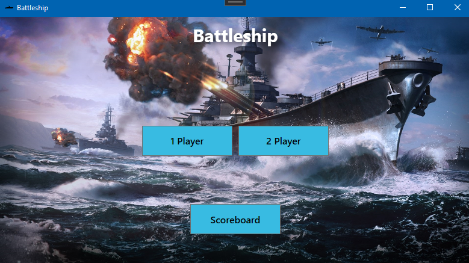
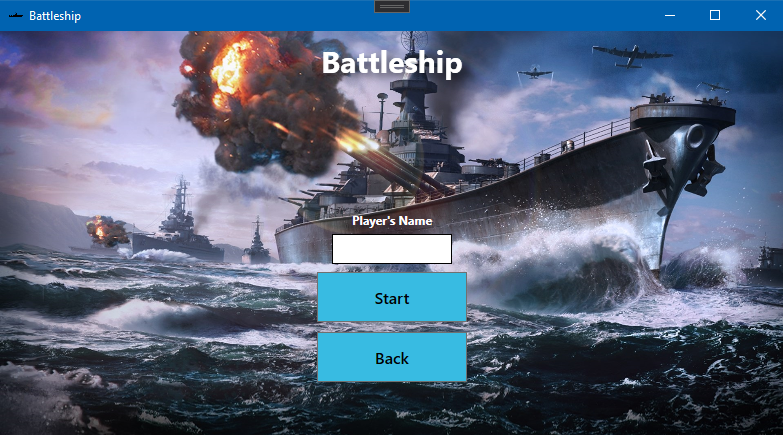
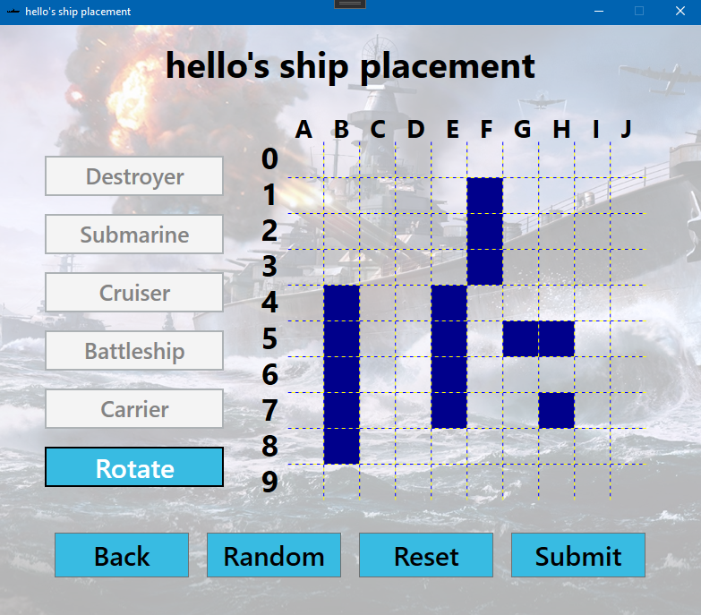
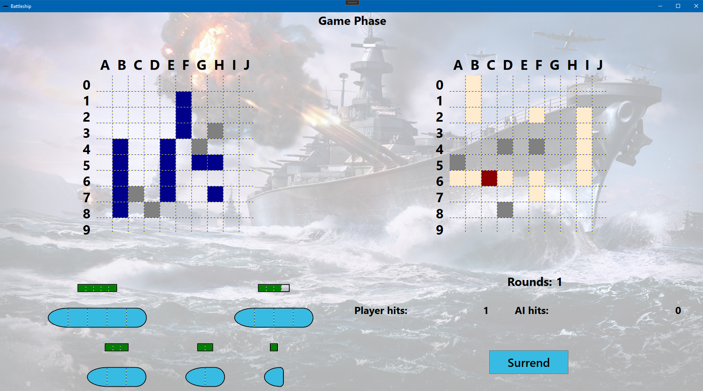
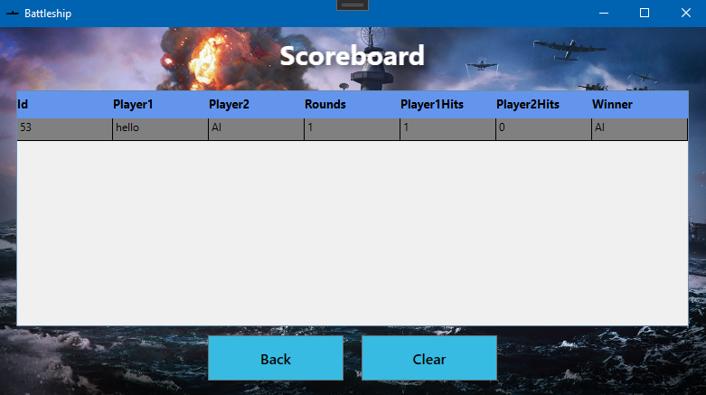

# Torpedó játék

> .NET-es grafikus (WPF keretrendszerben írt) játék elkészítése.

## Hogyan játszd

### Főképernyő
#

- Innen lehet elindítani az egyszemélyes/kétszemélyes játékot, illetve innen lehet eljutni az eredménytáblához is.

### Név bekérés
#

- Csak az angol ABC betűit írhatjuk be, kétszemélyes játék esetén a játékosoknak eltérő nevet kell megadniuk.

### Hajók lehelyezése
#

- Itt helyezhetjük le manuálisan a hajóinkat click&point módszerrel, vagy a Random gombra kattintva véletlenszerűen fogja lehelyezni a hajóinkat a gép. Oldalt a Rotate gomb segítségével forgathatjuk a hajóinkat lehelyezés előtt. A Reset gomb megnyomására 

### Játék
#

- Ez az egyszemélyes játék felülete. Bal oldalt látható a játékos táblája, a jobb oldalt pedig az AI-é. A Ctrl+F8 billentyűkombinációra megjelenítődnek az AI hajói világos négyzetekként. A bal alsó sarokban találhatóak az AI hajói, és azok életereje. A jobb oldali tábla valamelyik cellájára kattintva megváltozik a színe (találat esetén pirosra, ellenkező esetben pedig szürkére). A játék elején véletlenszerűen kiválasztódik a kezdőjátékos, majd felváltva lőnek a játékosok. Találat esetén tovább lőhet az adott fél. Az nyer, aki hamarabb süllyeszti el az ellenfél hajóit. Jobb alsó sarokban látható a két fél aktuális találatainak száma, valamint a körök száma. A Surrend gomb megnyomásával visszalépünk a főmenübe, és az AI kerül ki győztesként.

- A kétszemélyes játék nagyon hasonló, ott egyidejűleg csak az aktuális játékos ablaka van megnyitva, valamint a jobb alsó sarokban jelezve van, hogy aktuálisan melyik játékos következik.

### Eredménytábla
#

- Itt láthatóak a mindenkori eredmények Entity Framwork által megvalósítva. Tárolva vannak a játékosok nevei, a körök és az egyes játékosok találatainak a száma, valamint a győztes neve. A Clear gomb megnyomásával töröljük az eredménytáblát.

## Játék leírása

[Magyar](https://hu.wikipedia.org/wiki/Torped%C3%B3_(j%C3%A1t%C3%A9k))

## Követelmények

### Egymás ellen lehessen játszani ugyanazon a gépen, ugyanabban az alkalmazásban

- Két játékos nevet kér be
- A soron kövezkező játékos csak a saját játékmezőjét látja (életszerű helyzet szimulálása)

### AI ellen lehessen játszani

- Egy játékos nevet kér be
- Kezdő játékos véletlenszerűen választva
- AI elemezési sorrend
    1. Random találgat
    2. Ha van találat akkor már a mellette lévő mezőket lövi
         - UNIT tesztet írni a logikához (randomhoz nem muszáj)

### Játékmenet

- Belépéskor kérjen nevet, majd ahhoz mentse az eredményeket
    - Név nem lehet: üres, whitespace, különleges karakterek szűrése pl !?_-:;#
- Eredményjelző
    - Körök száma
    - Saját találatok
    - Ellenfél találatai
    - Milyen hajók vannak még és melyek lettek elsüllyesztve
    - Billentyűkombinációra mutassa meg az AI hajóit (Csak AI ellen működjön)

### Játék vége

- Tárolja le az eredményeket
    - Adatok tárolása: JSON, XML vagy adatbázis(Entity FWK)
- Mindenkori eredménylista beolvasva tárolt adatokból
    - Listázza az egyes korábbi menetek adatai táblázatban (játékosok, körök száma, játékosok találatai, nyertes)

### Egyéb követelmények

- Git repo
    - Rendszeres commit minden csapattagtól
- Egy solution használata
- Egy haladó technológia használata a felsoroltak közül (Entity FWK, Blazor, Async, MVVM)
- Konvenciók alkalmazása: [NI C# Style Guide](https://github.com/ni/csharp-styleguide)
    - Java, Python stílusú elnvezéseket ne használjatok
